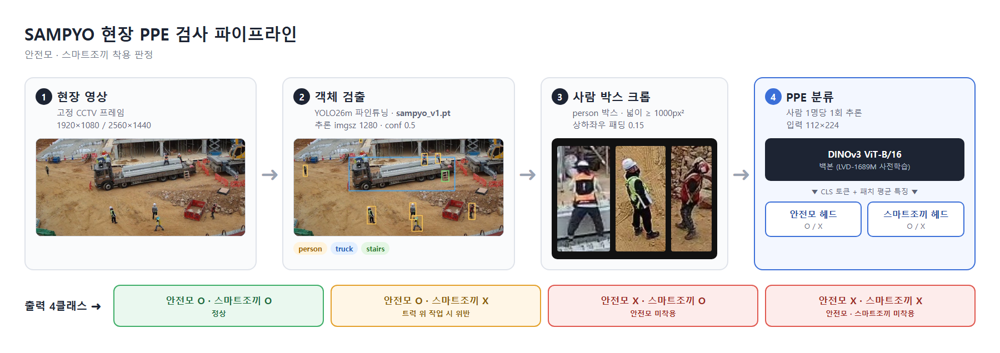

# 2026_SAMPYO

## To-do

### 환경
- [ ] `__DATA__/humanImage/` 노트북으로 옮기기 (git 미포함, 19,473장 + `crops.csv`, `review.csv`)
- [ ] `.venv` 생성 — torch(CUDA), `transformers>=4.56`, opencv-python, ultralytics
- [ ] Hugging Face 가입 → [facebook/dinov3-vitb16-pretrain-lvd1689m](https://huggingface.co/facebook/dinov3-vitb16-pretrain-lvd1689m) 라이선스 동의 → 토큰 발급 → `hf auth login`
- [ ] DINOv3 ViT-B/16 로딩 · 특징 추출 테스트

### 데이터
- [ ] DINOv3 특징으로 근접 중복 제거 (1초 간격 연속 프레임의 같은 사람)
- [ ] 라벨링 기준 확정
  - 스마트조끼 O: 위 주황 · 아래 검정 (앞/뒤/옆 모두)
  - 스마트조끼 X: 일반 안전조끼(연두·노랑), 하네스, 미착용
  - 판단불가: 너무 작거나 가려짐 → 학습 제외
- [ ] `scripts/review_crops.py` → 안전모/스마트조끼 라벨링 툴로 확장 (속성별 O / X / 판단불가)
- [ ] 스마트조끼 1~2천 장 수동 라벨링 → 1차 모델 예측 → 애매한 것만 검수
- [ ] 안전모 X 라벨링 (카메라3 약 50장)
- [ ] train / val / test 분리: 시간 구간·영상 단위 (랜덤 분리 금지)

### 모델
- [ ] `PPEClassifier`: DINOv3 백본 + 안전모 헤드 + 스마트조끼 헤드 → 4클래스 조합
- [ ] 라벨 없는 속성은 손실에서 제외 (스마트조끼만 먼저 학습 가능)
- [ ] 1단계: 백본 고정 + 헤드 학습 / 2단계: 마지막 2~4 블록 미세조정
- [ ] 평가: 속성별 X(위반) 재현율, 4×4 혼동행렬

### 현장 (복귀 후)
- [ ] 안전모 미착용 추가 촬영: 카메라1·2, 여러 명, 스마트조끼 착용 + 안전모 미착용 포함
- [ ] 트래킹 ID별 다중 프레임 투표
- [ ] 스마트조끼 판정은 `stair_check.py` 트럭 위(DECK) 작업자에만 적용
- [ ] 서비스 화면/문서에 "Built with DINOv3" 표기 (라이선스)
