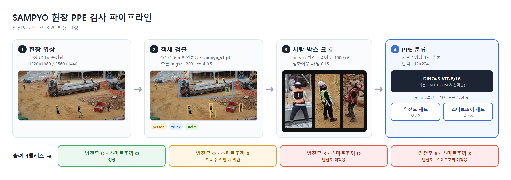

# 2026_SAMPYO

## To-do

### 환경
- [x] `.venv` 생성 — torch 2.6+cu124, transformers, opencv
- [x] Hugging Face 가입 → DINOv3 라이선스 동의 → 토큰 발급 → `hf auth login`
- [x] DINOv3 게이트 승인 완료 (`facebook/dinov3-vitb16-pretrain-lvd1689m`)
- 모델 캐시는 `HF_HOME=D:\Project_paimedia\.hf_cache` (C: 용량 부족). 토큰 파일도 이 경로 아래 있어야 함

### 데이터
- [x] 특징 추출 (`scripts/embed_crops.py`, DINOv3 ViT-B/16) → `__DATA__/features/embeddings.npy`
- [x] 근접 중복 묶기 (`scripts/dedup_crops.py --thr 0.90`) → 19,473장 → **8,523 묶음**
  - 0.84 이하는 다른 작업자가 섞임(미리보기로 확인), 0.90이 묶음 품질 안정
- [x] 라벨링 툴 (`scripts/label_ppe.py`, `라벨링툴.bat`) — 묶음 대표 1장 라벨 → 묶음 전체에 전파
- [ ] 라벨링 기준 확정
  - 스마트조끼 O: 위 주황 · 아래 검정 (앞/뒤/옆 모두)
  - 스마트조끼 X: 일반 안전조끼(연두·노랑), 하네스, 미착용
  - 판단불가: 너무 작거나 가려짐 → 학습 제외
- [x] 스마트조끼 라벨링 — 7,392묶음 (O 2,499 / X 4,819), 이미지 94% 커버
- [x] 예측 기반 검수 루프 (`predict_ppe.py` → 라벨링 툴 기본값)
- [x] train / val 분리: 120초 시간 블록 단위 + 카메라 홀드아웃

### 모델
- [x] 백본 고정 + 속성별 헤드 (`train_ppe.py`, hidden 512) → `__MODEL__/ppe_head.pt`
- [x] 스마트조끼 성능: 시간 분리 val 정확도 0.927 / 미착용 재현율 0.953
      · 카메라 홀드아웃 cam2 0.937, cam1(0916) 0.879
- [ ] **큰 크롭(200px+) 오답률 23%** — 트럭 위 작업자가 여기 해당, 개선 필요
- [ ] 노랑 계열 조끼 라벨 기준 확정 (O 라벨 2,499개 중 노랑 67 · 연두 25, 이 구간 오답률 52~63%)
- [ ] 안전모: 카메라3 편향으로 사용 불가 — 현장 재촬영 전까지 보류 (헤드 분리라 조끼만 운용 가능)
- [ ] 필요 시 2단계: 백본 마지막 2~4 블록 미세조정

### 현장 (복귀 후)
- [ ] 안전모 미착용 추가 촬영: 카메라1·2, 여러 명, 스마트조끼 착용 + 안전모 미착용 포함
- [ ] 트래킹 ID별 다중 프레임 투표
- [ ] 스마트조끼 판정은 `stair_check.py` 트럭 위(DECK) 작업자에만 적용
- [ ] 서비스 화면/문서에 "Built with DINOv3" 표기 (라이선스)
